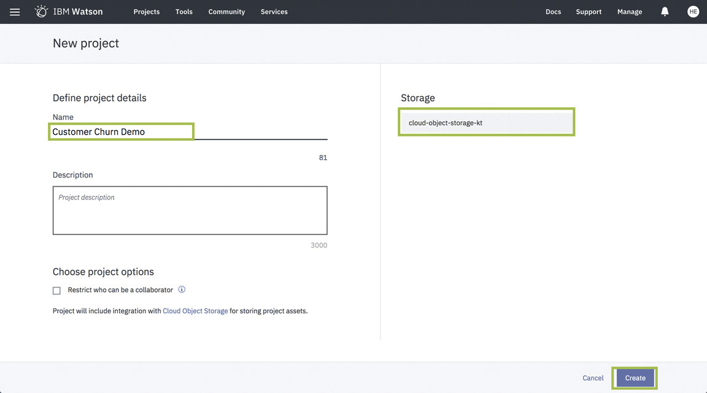
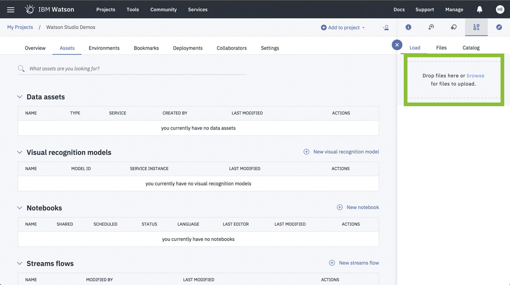
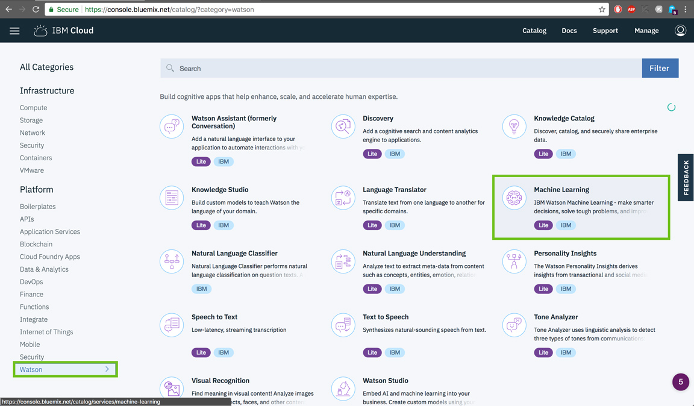
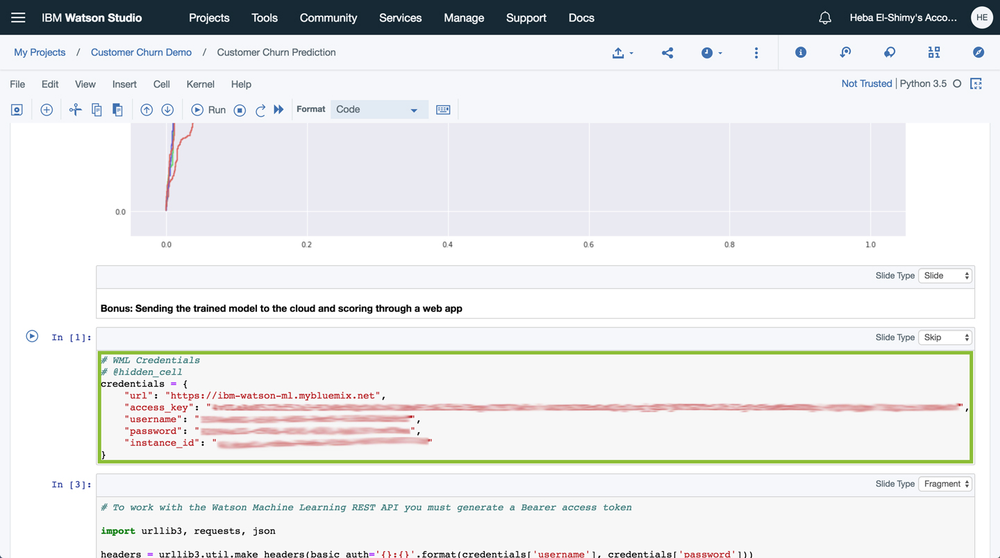
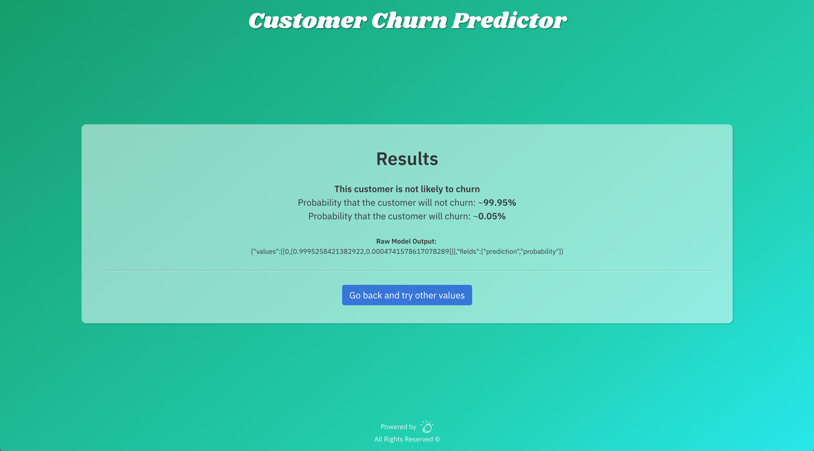

# Work In Progress. Please re-visit soon for the completed code pattern

# Predictor Customer Churn using Watson Studio and Jupyter Notebooks
In this Code Pattern, we use IBM Watson Studio to go through the whole data science pipeline to solve a business problem and predict customer churn using a Telco customer churn dataset. Watson Studio is an interactive, collaborative, cloud-based environment where data scientists, developers, and others interested in data science can use tools (e.g., RStudio, Jupyter Notebooks, Spark, etc.) to collaborate, share, and gather insight from their data as well as build and deploy machine learning and deep learning models.

When the reader has completed this Code Pattern, they will understand how to:

* Use [Jupyter Notebooks](http://jupyter.org/) to load, visualize, and analyze data
* Run Notebooks in [IBM Watson Studio](https://dataplatform.ibm.com/)
* Load data from [IBM Cloud Object Storage](https://console.bluemix.net/catalog/services/cloud-object-storage)
* Build, test and compare different machine learning models using [Scikit-Learn](http://scikit-learn.org/)
* Deploy a selected machine learning model to production using Watson Studio
* Create a front-end application to interface with the client and start consuming your deployed model.


## Flow

1. Understand the business problem.
2. Load the provided notebook into the Watson Studio platform.
3. [Telco customer churn data set](https://community.watsonanalytics.com/wp-content/uploads/2015/03/WA_Fn-UseC_-Telco-Customer-Churn.csv) is loaded into the Jupyter Notebook.
4. Decribe, analyze and visualize data in the notebook.
5. Preprocess the data, build machine learning models and test them..
6. Deploy a selected machine learning model into production.
7. Interact and consume your model using a frontend application.

## Included components

* [IBM Watson Studio](https://www.ibm.com/us-en/marketplace/data-science-experience): Analyze data using RStudio, Jupyter, and Python in a configured, collaborative environment that includes IBM value-adds, such as managed Spark.
* [IBM Cloud Foundry](https://console.bluemix.net/dashboard/cloudfoundry/overview): Deploy and run your applications without managing servers or clusters. Cloud Foundry automatically transforms source code into containers, scales them on demand, and manages user access and capacity.

## Featured technologies

* [Jupyter Notebooks](http://jupyter.org/): An open-source web application that allows you to create and share documents that contain live code, equations, visualizations and explanatory text.
* [Pandas](https://pandas.pydata.org/):  An open source library providing high-performance, easy-to-use data structures and data analysis tools for the Python programming language.
* [Seaborn](https://seaborn.pydata.org/): A Python data visualization library based on matplotlib. It provides a high-level interface for drawing attractive and informative statistical graphics.
* [Scikit-Learn](http://scikit-learn.org/): Machine Learning in Python. Simple and efficient tools for data mining and data analysis.
* [Watson Machine Learning Client](https://pypi.org/project/watson-machine-learning-client/): A library that allows to work with Watson Machine Learning service on [IBM Cloud](https://console.bluemix.net/catalog/services/machine-learning). Train, test and deploy your models as APIs for application development, share with colleagues using this python library.
* [NodeJS](https://nodejs.org/): A JavaScript runtime built on Chrome's V8 JavaScript engine, used for building full stack Javascript web applications.
* [ExpressJS](https://expressjs.com/): A minimal and flexible Node.js web application framework that provides a robust set of features for web and mobile applications.

# Watch the Video

[](https://youtu.be/qchkktwMA6U)

# Steps

1. [Sign up for Watson Studio](#1-sign-up-for-watson-studio)
2. [Create a new Project](#2-create-a-new-project)
3. [Upload the dataset](#3-upload-the-dataset)
4. [Import notebook to Watson Studio](#4-import-notebook-to-watson-studio)
5. [Import dataset into the notebook](#5-import-dataset-into-the-notebook)
6. [Follow the steps in the notebook](#6-follow-the-steps-in-the-notebook)
7. [Create Watson Machine Learning Service instance](#7-create-watson-machine-learning-service-instance)
8. [Deploy your model to the cloud](#8-deploy-your-model-to-the-cloud)
9. [Try out the model by using the frontend application](#9-try-out-the-model-by-using-the-frontend-application)

### 1. Sign up for Watson Studio

Sign up for IBM's [Watson Studio](https://dataplatform.ibm.com/). By creating a project in Watson Studio a free tier Object Storage service will be created in your IBM Cloud account. Take note of your service names as you will need to select them in the following steps.

> Note: When creating your Object Storage service, select the Free storage type in order to avoid having to pay an upgrade fee.

### 2. Create a new Project

* On Watson Studio's Welcome Page select **New Project**.


* Choose the **Complete** option.


* Name your project, select the Cloud Object Storage service instance and click **Create**.



### 3. Upload the dataset

* Download the dataset we will use in this pattern from the following link: [https://community.watsonanalytics.com/wp-content/uploads/2015/03/WA_Fn-UseC_-Telco-Customer-Churn.csv](https://community.watsonanalytics.com/wp-content/uploads/2015/03/WA_Fn-UseC_-Telco-Customer-Churn.csv)


* Drag and drop the dataset (csv) file you just downloaded to Watson Studio's dashboard to upload it to Cloud Object Storage.



* Don't change the page as to not interrupt the upload process, once it's done you should find the dataset under the **Data assets** category.


### 4. Import notebook to Watson Studio

* Create a **New Notebook**.


* Import the notebook found in this repository inside the notebook folder by copying and pasting this url in the relevant field `https://github.com/IBM/customer-churn-prediction/blob/master/notebooks/customer-churn-prediction.ipynb`. Give a name to the notebook and select a runtime environment, then click **Create**.


### 5. Import dataset into the notebook

To make the dataset available in the notebook, we need to refer to where it lives. Watson Studio automatically generates a connection to your Cloud Object Storage instance and gives access to your data.

* Click in the cell below `2. Loading Our Dataset`
* Then go to the Files section to the right of the notebook and click `Insert to code` for the data you have uploaded. Choose `Insert pandas DataFrame`.

### 6. Follow the steps in the notebook

The steps should allow you to understand the dataset, analyze and visualize it. You will then go through the preprocessing and feature engineering processes to make the data suitable for modelling. Finally, you will build some machine learning models and test them to compare their performances.

### 7. Create Watson Machine Learning Service instance

When you reach the part in the notebook where we start the deployment of a selected model, make sure you have a running instance of **Watson Machine Learning Service**. If you don't have one already, follow these steps to create one.

* From [IBM Cloud Catalog](https://console.bluemix.net/catalog/), under the Watson category, select **Machine Learning**.



* Keep the setting as they are and click **Create**.


* Once the service instance is created, navigate to **Service credentials**, view credentials and make note of them.

> Note: If you can't see any credentials available, you can create a **New credential**.


* In the notebook availble with this pattern, there is a cell with the WML credentials available, you just need to replace the code inside with your credentials.



### 8. Deploy your model to the cloud

Follow the steps in the notebook to deploy your model on the cloud.

> Note: the url generated as an endpoint for scoring using your model will be different than the one in this notebook, please use your generated url to test your own model.

### 9. Build the frontend application.

> Go to [https://customer-churn-webapp.mybluemix.net/](https://customer-churn-webapp.mybluemix.net/) to try out the model through a user interface.

For developing the UI locally and testing it:

* Clone this repo and navigate to the `frontend/` folder.

* Use your favorite IDE and have a terminal or command prompt ready and cd into the `frontend/` folder.

* Install the required node modules by typing `npm install`.

* Create a `.env` file in frontend folder (frontend/.env) to hold your credentials.

> This application communicates with services on IBM Cloud and requires authentication using your own credentials to each of those different services. If the application is deployed to IBM Cloud, these credentials will be stored in a variable called `VCAP_SERVICES` inside `process.env` and will be grabbed by default through the code written in the `server/server.js` file in our app. However, to develop and test locally, you need the same credentials stored in an environment mimicking the cloud environment. For this we use a node module called `dotenv`, and its function is to grab secrets that you stored in a `.env` file and parse it into `process.env` and make it avilable for your application. The secrets are stored as plain text.

For our purposes here, our `.env` file will look like the following:

```
WML_INSTANCE_NAME=**Enter with your Watson Machine Learning service instance name**
USERNAME=**Enter your WML username found in credentials**
PASSWORD=**Enter your WML password found in credentials**
INSTANCE_ID=**Enter your WML instance_id found in credentials**
URL=**Enter your WML url found in credentials**
PORT=3000
MODEL_URL=**Change with your model url after deploying it to the cloud as in step 8**

```

> You can find screenshots of how to get these credentials in step 7 in this documentation.

* Run the application. You can do that by typing in your terminal `npm start` to start the local development server, or by typing `npm run dev` to run an interactive server that watches any changes you make to the application, specifically `server.js` while developing locally.
You can view the application in any browser by navigating to: `http://localhost:3000`. Feel free to test it out.

If you're happy with the application and want to deploy it to the cloud, you can follow one of three methods:

#### 1. Using Docker:
If you already have Docker and the [IBM Cloud CLI](https://console.bluemix.net/docs/cli/reference/ibmcloud/download_cli.html#install_use) installed on your system, it is easy to build and deploy the application using the settings in the Dockerfile accompanied within this repo.

* After cloning this repo, use the terminal (unix) or a command prompt (windows) to navigate to the `frontend/` folder in this repo.

* Type the following command:

```
ibmcloud dev build
```

After this step finishes successfully with no errors, type in the following:

```
ibmcloud dev deploy
```

At the end of this step you should get a message in your terminal notifying you that the deployment was successful and giving you the url to visit the app online.


#### 2. Using IBM Cloud CLI:
In your terminal, and inside the `frontend/` folder, type in the following:

```
ibmcloud app push
```

This will use the settings in `frontend/manifest.yml` to define different application settings, like how much memory it uses, the host and domain names, etc.

At the end of this step you should get a message in your terminal notifying you that the deployment was successful and giving you the url to visit the app online as well as the health status of your app.


#### 3. Using IBM Cloud Toolchain:
You can deploy your application by using automated, preconfigured devops process, that grabs code from your repo (you need a github repo), the process is triggered upon a push, then the toolchain starts the staging and building process. You can add other stages too, like testing, etc.

You can start a toolchain and configure it here:
[https://console.ng.bluemix.net/devops/setup/deploy/](https://console.ng.bluemix.net/devops/setup/deploy/)

> Know more about IBM Cloud DevOps here: [https://www.ibm.com/cloud-computing/bluemix/devops](https://www.ibm.com/cloud-computing/bluemix/devops)

Or you can click on the following button to clone the repo for this frontend app and create a toolchain to start deploying the app from there.

[](https://bluemix.net/deploy?repository=https://github.com/IBM/customer-churn-prediction)

Clicking on the previous button will direct you to the following page:


You will then be asked to authorize IBM Cloud to connect to your GitHub account, follow the steps to grant access.


Now you will be asked to type in an API key. You can go ahead and let the tool create one for you.


Below is the final step before building and deploying the app. Feel free to change the settings here, but make sure that you're pointing to the correct repo. The one populated by default from the above button will deploy the app used in this pattern. If you want to deploy a similar app you built and pushed to your repo, change the settings accordingly.


#### Connecting the UI with Watson Machine Learning
After we deployed our app to the cloud, now it has no clue about our running instance of Watson Machine Learning. It needs to know about it so it can put its credentials in `process.env` so the call to the api works, as we did locally. To connect your frontend app with wml service, follow these steps:

* From [IBM Cloud Dashboard](https://console.bluemix.net/dashboard/apps), find the Cusomter churn app under Clloud Foundry Applications section and click on it. This will open the application management console. In the **Connections** section, click **Create Connection**.


* A list of all your availble IBM Cloud services you have running will appear, choose the **Machine Learning** service and click **Connect**.


* Now in your connections, you should find the WML service appearing in the list.


* Click on the 3 dots on the right of the wml service card, and choose **View credentials**.


* These are your environment variables that were generated for your frontend app to use. These are stored in `process.env` in an object called `VCAP_SERVICES`. This is what we mimicked locally with the `dotenv` node module. As you can see, your wml credentials are stored here as well.


* Now, let's add a couple more environmental variable for our code to run smoothly. To add cusom environment variables, click the application **Runtime** option in the left sidebar. This is another way to access all environment variables bound to this Cloud Foundry app. Let's start creating our variables.


* Let's add a variable that defines the machine learning model's endpoint (generated in step 8 after deployment, change the value here to your own). We also need to add the Watson Machine Learning service instance name. After you finished adding these environment variables, click **Save** for changes to take effect.


# Sample output

* Using Postman:


* Using the UI app:



# Links
* [Demo video on Youtube](https://youtu.be/qchkktwMA6U)
* [Read more about CRISPDM](https://www.ibm.com/support/knowledgecenter/en/SS3RA7_15.0.0/com.ibm.spss.crispdm.help/crisp_overview.htm)

# Learn more
* **Artificial Intelligence Code Patterns**: Enjoyed this Code Pattern? Check out our other [AI Code Patterns](https://developer.ibm.com/code/technologies/artificial-intelligence/).
* **Data Analytics Code Patterns**: Enjoyed this Code Pattern? Check out our other [Data Analytics Code Patterns](https://developer.ibm.com/code/technologies/data-science/)
* **AI and Data Code Pattern Playlist**: Bookmark our [playlist](https://www.youtube.com/playlist?list=PLzUbsvIyrNfknNewObx5N7uGZ5FKH0Fde) with all of our Code Pattern videos
* **With Watson**: Want to take your Watson app to the next level? Looking to utilize Watson Brand assets? [Join the With Watson program](https://www.ibm.com/watson/with-watson/) to leverage exclusive brand, marketing, and tech resources to amplify and accelerate your Watson embedded commercial solution.
* **IBM Watson Studio**: Master the art of data science with IBM's [Watson Studio](https://datascience.ibm.com/)

# License
[Apache 2.0](LICENSE)
